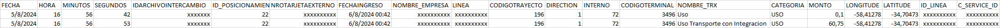
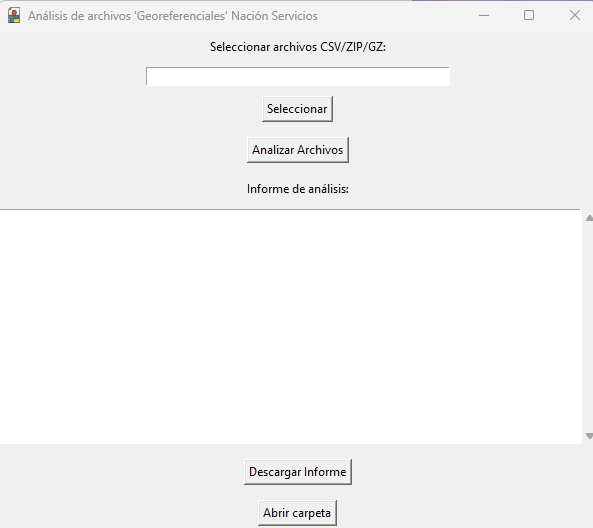
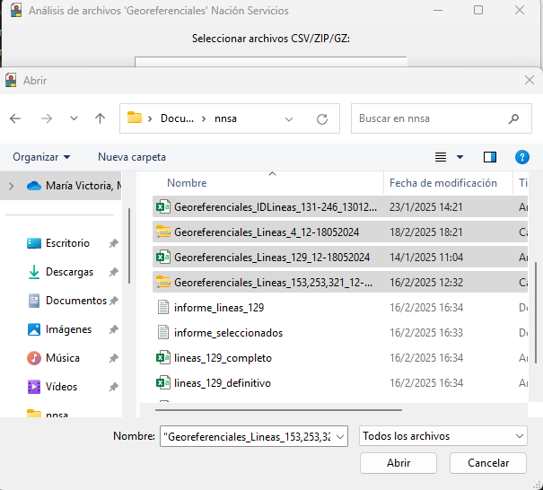
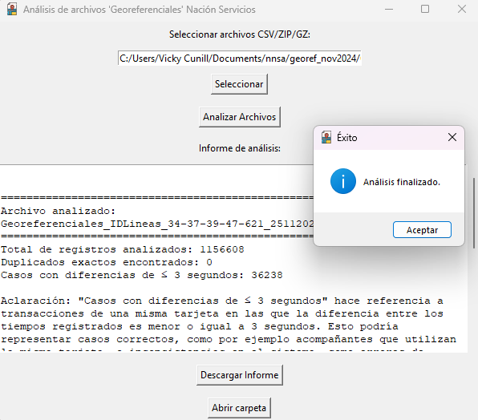
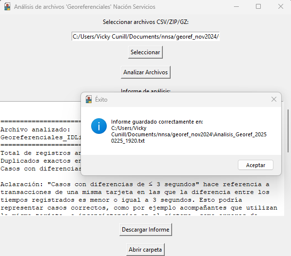

# Análisis de Datos Georeferenciales (AnalisisArchivos)

Este proyecto permite analizar archivos CSV de datos Georreferenciales, detectando duplicados y patrones inconsistentes en las transacciones.

## **Características**
- Análisis de duplicados exactos y transacciones con diferencias menores o iguales a 3 segundos.
- Informe detallado de los resultados directamente en la interfaz gráfica.
- Descarga del informe en formato .txt.

## **Estructura del Proyecto**
analisisDatosNNSS/
├── main.py                # Archivo principal que ejecuta el programa
├── src/
│   ├── analisis.py        # Lógica de análisis
│   └── interfaz.py        # Configuración de la interfaz gráfica
├── assets/
│   └── icono.ico          # Ícono del programa
└── README.md              # Documentación del proyecto

##  **Cómo Iniciar la Aplicación**
### **Requisitos Previos**

    - **Python 3.8 o superior**

    - Ejecutar desde el Código Fuente
        Clonar el repositorio: git clone https://github.com/vickycun/Analisis_datos_Georef.git

    - Activar el entorno virtual:
        source env/bin/activate   # En Linux/Mac
        env\Scripts\activate      # En Windows

    - Ejecutar el script principal: python main.py

## **Cómo usar el programa**
1. Seleccionar archivo/s CSV/ZIP/GZ
2. Presionar el botón "Analizar los datos"
3. En la ventana central, aparecerá un reporte del procesamiento de los archivos
3. Si se presiona el botón "Descargar Informe", se descarga un txt, al mismo directorio donde están los archivos analizados.

## **Generar el ejecutable**
Para crear un ejecutable con PyInstaller, usar el siguiente comando desde la raíz del proyecto:

`pyinstaller --onefile --name "Nombre_Del_Programa" --icon="assets/icono.ico" --add-data "assets/icono.ico;assets" --noconsole main.py` 

El ejecutable se generará en la carpeta dist.

## Capturas de Pantalla

## **Licencia**  
Este proyecto se encuentra bajo la Licencia MIT. Consultá el archivo [LICENSE](LICENSE) para más detalles
